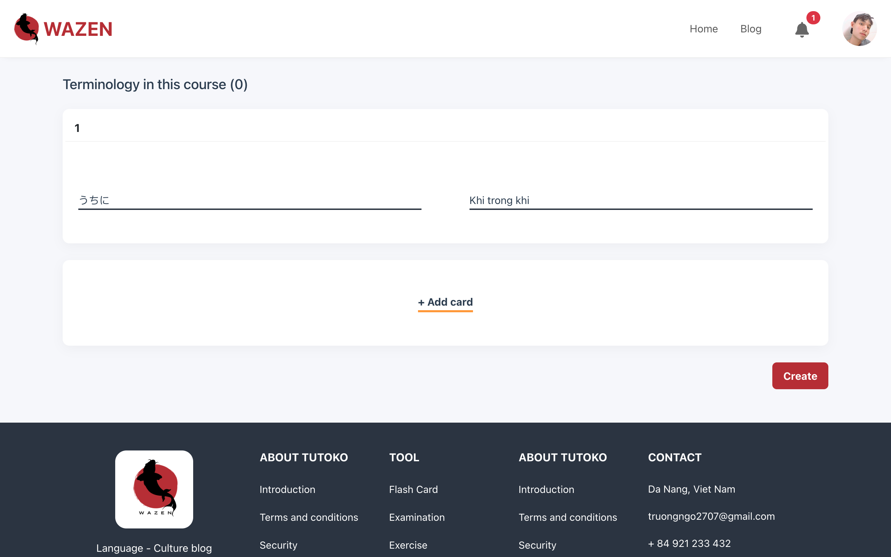

# Wazen - The website supports learning the Japanese language and culture

The website supports learning Japanese, where exploring a new language is not just about learning vocabulary and grammar, but also about gaining a deeper understanding of the mindset and way of life of the people who use that language. A multi-faceted learning environment helps to comprehend both the Japanese language and Japanese culture.

#### What are the built-in features in the project?
* Learning Japanese through flashcards
* Blogs sharing about language and culture

#### Technology and Framework were used in this project:
* Backend: NodeJS
* Frontend: Vue3 + Vite
* DB: MongoDB - Express framework

#### How to use?
**1. Download and import Database:**
* Download database from link: [Database MongoDB](https://drive.google.com/drive/folders/1BHns8LH1JcR2O7KL__A1un88qFQ3dxTi?usp=sharing)
* Import all JSON files into MongoDB

**2. To get started with this project, follow these steps:**
1. Clone the repository: 
```sh 
    git clone https://github.com/NgoMauTruongQB/node-vue-project-wazen.git
```
2. Server
* Navigate to the `server` directory: `cd server`.
* Install dependencies: `npm install`.
* Run the server: `npm start`
3. Client
* Navigate to the `client` directory: `cd client`.
* Install dependencies: `npm install`.
* To start the development server: `npm run dev`.

#### Features
##### 1. Server
- User authentication using a combination of Refresh Token + Access Token.
- File upload and storage on Cloudinary.
- Password encryption using bcrypt.
##### 2. Client
- Valiadtion using Vuelidate.
- Responsive design using Bootstrap.
- State management with Pinia.

### Demo UI 





&emsp;&ensp;


